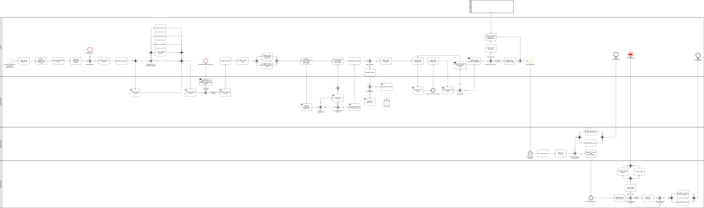
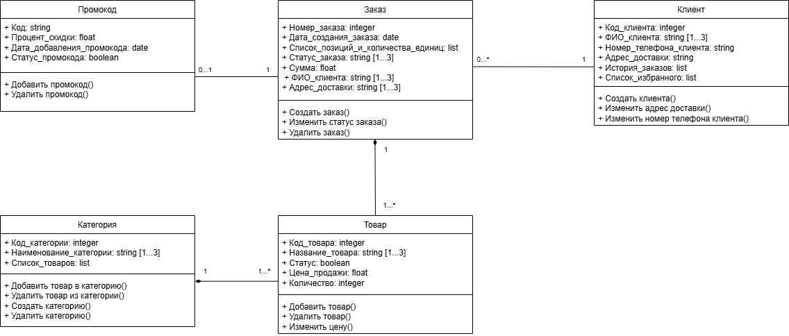
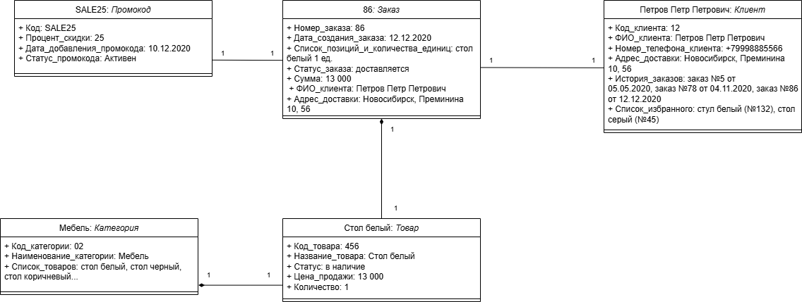

# Документ с требованиями к решению
## Введение
Настоящий документ представляет собой техническое задание на разработку и внедрение программного решения, направленного на автоматизацию и оптимизацию бизнес-процессов. Документ содержит описание функциональных и нефункциональных требований, архитектуры решения, а также критериев приёмки и возможных рисков.

**Целью данного документа является:**
- формализация требований заказчика к разрабатываемому решению;
- описание бизнес-процессов, которые будут автоматизированы;
- определение критериев успешной реализации проекта.

**Задачи документа:**
- описать бизнес-требования и пользовательские сценарии;
- предложить архитектуру решения, включая диаграммы классов и объектов;
- определить критерии приёмки и возможные риски.

### Цель проекта
Улучшить сайт магазина «Переделкино» за счет доработки UI/UX-дизайна, добавления нового функционала, интеграции с БД склада.

Изменения позволят достичь следующих показателей:
- через 3 месяца увеличить количество оплаты онлайн банковской картой на 30%;
- через 3 месяца увеличить среднее количество пользователей сайта на 20%;
- через 3 месяца увеличить среднее количество выполненных заказов на 15%;
- через 3 месяца увеличить количество зарегистрированных пользователей на 20%;
- через 3 месяца увеличить количество использования промокодов на 30%;
- через 3 месяца увеличить количество подтвержденных заказов на 60%
- через 3 месяца уменьшить нагрузку на администраторов на 30%.
### Глоссарий
В этом отчёте об обследовании применяют такие термины с соответствующими определениями, обозначения и сокращения:
|№ п/п|Термин или сокращение|Определение|
|-|--------|---|
|1|API (Application Programming Interface)|Программный интерфейс приложения, позволяющий интегрировать разные системы и обмениваться данными между ними|
|2|UI-дизайн|Дизайн пользовательского интерфейса|
|3|UX-дизайн|Дизайн взаимодействия с пользователем|
|4|БД|База данных|
|5|Заказчик|ООО «Переделкино»|
|6|Исполнитель|ООО «АйТи Решения Практикум»|
## Описание требований
### Бизнес-требования (business requirements)
- **BR-1**: через 3 месяца 30% заказов должны использовать промокоды, что составит 1071 заказ в месяц;
- **BR-2**: через 3 месяца 20% посетителей должны зарегистрироваться, что составит 827 пользователей в месяц;
- **BR-3**: через 3 месяца средний чек заказов с промокодами должен быть на 15% выше, чем без них;
- **BR-4**: через 3 месяца количество заказов должно увеличиться на 15%, что составит 4107 заказов в месяц.

### Пользовательские требования
**Пользовательские истории (user stories)**

- **US 1**: как пользователь, я хочу иметь возможность оплатить заказ онлайн банковской картой, чтобы не искать наличные;
- **US 2**: как пользователь, я хочу искать товары на сайте через поисковую строку, чтобы быстро находить нужный мне товар;
- **US 3**: как пользователь, я хочу видеть подробное описание товара в его карточке, чтобы подбирать подходящий товар;
- **US 4**: как пользователь, я хочу использовать фильтры при поиске товара в каталоге, чтобы сократить время для поиска;
- **US 5**: как пользователь, я хочу иметь возможность закрыть чат поддержки, чтобы он не мешал пользоваться сайтом; 
- **US 6**: как пользователь, я хочу видеть общую сумму заказа в корзине, чтобы знать, сколько денег надо заплатить;
- **US 7**: как пользователь, я хочу видеть итоговую сумму заказа в разделе «Оформление заказа», чтобы знать, сколько денег надо заплатить;
- **US 8**: как пользователь, я хочу видеть товары в наличие, чтобы как можно быстрее получить их;
- **US 9**: как пользователь, я хочу иметь возможность полностью очистить корзину заказов, чтобы быстро удалить все товары;
- **US 10.1**: как пользователь, я хочу иметь возможность добавлять товары в избранное, чтобы быстро находить понравившиеся позиции из каталога;
- **US 10.2**: как пользователь, я хочу иметь возможность удалять товары из избранного, чтобы в списке избранного были только нужные позиции;
- **US 11.1**:  как пользователь, я хочу иметь личный кабинет на сайте, чтобы видеть историю покупок;
- **US 11.2**: как пользователь, я хочу иметь личный кабинет на сайте, чтобы повторно не заполнять информацию для доставки;
- **US 11.3**: как пользователь, я хочу иметь личный кабинет на сайте, чтобы смотреть список избранного;
- **US 12**: как пользователь, я хочу проверить правильность введенного мобильного номера на сайте, чтобы избежать ошибок при вводе;
- **US 13**: как пользователь, я хочу обращаться в чат-поддержку сайта, чтобы быстро решать возникшие вопросы;
- **US 14**: как пользователь, я хочу иметь возможность вводить промокод при оформлении заказа, чтобы получать скидку на покупку.
### Варианты использования (use cases)
**UC 1: Оплатить онлайн банковской картой**
| Параметр          | Значение                                                                 |
|-------------------|-------------------------------------------------------------------------|
| **Вариант использования** | Оплатить онлайн банковской картой                                       |
| **Уровень**       | Цели пользователя                                                       |
| **Основной актор**| Клиент сайта                                                            |
| **Предусловие**   | 1. Клиент перешел в раздел «Оформление заказа». 2. В корзине клиента сумма заказа более 1000 руб. |
| **Описание**      | 1. Клиент нажал чек-бокс способа оплаты «Онлайн-оплата банковской картой». 2. Система вывела интерфейс сервиса онлайн-оплаты. 3. Клиент вводит необходимые данные в форме сервиса онлайн-оплаты. 4. Система выводит уведомление об успешной оплате заказа. |
| **Расширения**    | 2.1. Система вывела ошибку «Сервис недоступен. Повторите попытку или попробуйте позже». |

**UC 2: Поиск товаров с помощью поисковой строки**
| Параметр          | Значение                                                                 |
|-------------------|-------------------------------------------------------------------------|
| **Вариант использования** | Поиск товаров с помощью поисковой строки                                |
| **Уровень**       | Цели пользователя                                                       |
| **Основной актор**| Клиент сайта                                                            |
| **Предусловие**   | Клиент находится на главной странице или странице каталога              |
| **Описание**      | 1. Клиент нажимает ЛКМ по строке поиска. 2. Клиент вводит наименование товара. 3. Система показывает подсказки поисковой выдачи. 4. Пользователь нажимает кнопку «Найти». 5. Система выводит найденные товары. |
| **Расширения**    | 3.1. Пользователь нажимает ЛКМ по подсказке системы. Переход к шагу 5 основного сценария.  3.1. Система отображает ошибку «Товар не найден». Переход к шагу 1 основного сценария. |

**UC 3: Изучение подробного описания товара**
| Параметр          | Значение                                                                 |
|-------------------|-------------------------------------------------------------------------|
| **Вариант использования** | Изучение подробного описания товара                                   |
| **Уровень**       | Цели пользователя                                                       |
| **Основной актор**| Клиент сайта                                                            |
| **Предусловие**   | 1. Клиент находится в карточке товара. 2. Карточка товара заполнена полностью или частично. |
| **Описание**      | 1. В карточке товара клиент нажимает ЛКМ по кнопке «Подробнее». 2. Система отображает характеристики, описание функционала, инструкции и др. к товару. |
| **Расширения**    | 2.1. Если характеристики отсутствуют, система скрывает кнопку «Характеристики». |

**UC 4: Использование фильтров при поиске товара в каталоге**
| Параметр          | Значение                                                                 |
|-------------------|-------------------------------------------------------------------------|
| **Вариант использования** | Использование фильтров при поиске товара в каталоге                   |
| **Уровень**       | Цели пользователя                                                       |
| **Основной актор**| Клиент сайта                                                            |
| **Предусловие**   | 1. Клиент находится на главной странице или странице каталога. 2. Клиент находится в интерфейсе поисковой строки. |
| **Описание**      | 1. Клиент нажимает ЛКМ по кнопке «Фильтры». 2. Система отображает выпадающий список фильтров: характеристики товаров, статус товара (в наличии, доступен под заказ), диапазон цены, цвет и др. 3. Клиент выбирает необходимые параметры фильтрации. 4. Система обновляет список товаров в каталоге с учетом выбранных фильтров. |
| **Расширения**    | 4.1. Система не находит подходящие товары и выводит надпись «Товары не найдены». |

**UC 5: Закрыть чат-поддержки**
| Параметр          | Значение                                                                 |
|-------------------|----|
| **Вариант использования** | Закрыть чат-поддержки                                               |
| **Уровень**       | Цели пользователя                                                       |
| **Основной актор**| Клиент сайта                                                            |
| **Предусловие**   | Чат-поддержки открыт на сайте.                                          |
| **Описание**      | 1. Клиент нажимает ЛКМ на крестик чата-поддержки. 2. Система сворачивает окно чата-поддержки. |
| **Расширения**    | -                                                                     |

**UC 6: Просмотр общей суммы заказа в корзине**
| Параметр          | Значение                                                                 |
|-------------------|-------------------------------------------------------------------------|
| **Вариант использования** | Просмотр общей суммы заказа в корзине                                |
| **Уровень**       | Цели пользователя                                                       |
| **Основной актор**| Клиент сайта                                                            |
| **Предусловие**   | В корзине есть хотя бы один товар.                                       |
| **Описание**      | 1. Клиент переходит в раздел «Корзина». 2. Система отображает сумму всех позиций в корзине под списком товаров. |
| **Расширения**    | 2.1. Клиент применяет промокод. 2.2. Система отображает сумму всех позиций в корзине с учетом скидки под списком товаров. |

**UC 7: Просмотр общей суммы заказа в разделе «Оформление заказа»**
| Параметр          | Значение                                                                 |
|-------------------|-------------------------------------------------------------------------|
| **Вариант использования** | Просмотр общей суммы заказа в разделе «Оформление заказа»           |
| **Уровень**       | Цели пользователя                                                       |
| **Основной актор**| Клиент сайта                                                            |
| **Предусловие**   | В корзине есть хотя бы один товар.                                       |
| **Описание**      | 1. Клиент переходит в раздел «Оформление заказа». 2. Система отображает итоговую сумму заказа. |
| **Расширения**    | 2.1. Клиент применяет промокод. 2.2. Система отображает итоговую сумму заказа. |

**UC 8: Просмотр статуса товара**
| Параметр          | Значение                                                                 |
|-------------------|-------------------------------------------------------------------------|
| **Вариант использования** | Просмотр статуса товара                                             |
| **Уровень**       | Цели пользователя                                                       |
| **Основной актор**| Клиент сайта                                                            |
| **Предусловие**   | БД склада синхронизирована с данными позиций на сайте.                   |
| **Описание**      | 1. Клиент переходит в карточку товара. 2. Система отображает текущее наличие товара на складе в штуках. |
| **Расширения**    | 2.1. Система отображает надпись «Товар отсутствует в наличии». 2.2. Система отображает «Доступен под заказ (срок поставки)». |

**UC 9: Удаление товаров в корзине**
| Параметр          | Значение                                                                 |
|-------------------|-------------------------------------------------------------------------|
| **Вариант использования** | Удаление товаров в корзине                                           |
| **Уровень**       | Цели пользователя                                                       |
| **Основной актор**| Клиент сайта                                                            |
| **Предусловие**   | В корзине есть товары.                                                  |
| **Описание**      | 1. Клиент переходит в раздел «Корзина». 2. Система отображает список позиций. 3. Клиент нажимает кнопку «Очистить корзину» под списком товаров. 4. Система удаляет все товары из корзины. |
| **Расширения**    | 3.1. Клиент нажимает около иконки товара. 4.1. Система полностью удаляет выбранный товар из корзины. |

**UC 10.1: Добавление товаров в избранное**
| Параметр          | Значение                                                                 |
|-------------------|-------------------------------------------------------------------------|
| **Вариант использования** | Добавление товаров в избранное                                       |
| **Уровень**       | Цели пользователя                                                       |
| **Основной актор**| Клиент сайта                                                            |
| **Предусловие**   | 1. У клиента есть личный кабинет. 2. Клиент авторизирован.            |
| **Описание**      | 1. Клиент нажимает ЛКМ по на изображении товара в каталоге. 2. Система добавляет товар в список избранного клиента. 3. Система выводит уведомление «Товар добавлен в избранное». |
| **Расширения**    | 1. Клиент нажимает ЛКМ по кнопке «Добавить в избранное» в карточке товара. Переход к шагу 2 основного сценария. |

**UC 10.2: Удаление товаров из избранного**
| Параметр          | Значение                                                                 |
|-------------------|-------------------------------------------------------------------------|
| **Вариант использования** | Удаление товаров из избранного                                      |
| **Уровень**       | Цели пользователя                                                       |
| **Основной актор**| Клиент сайта                                                            |
| **Предусловие**   | 1. У клиента есть личный кабинет. 2. Клиент авторизирован. 3. В списке избранного есть хотя бы один товар. |
| **Описание**      | 1. Клиент нажимает ЛКМ по на изображении товара в списке избранного. 2. Система удаляет товар из списка избранного. 3. Система выводит уведомление «Товар удален из избранного». |
| **Расширения**    | 1. Клиент нажимает ЛКМ по кнопке «Удалить из избранного» в карточке товара. Переход к шагу 2 основного сценария. 2. Клиент нажимает ЛКМ по на изображении товара в каталоге. Переход к шагу 2 основного сценария. |

**UC 11.1: Просмотр истории покупок**
| Параметр          | Значение                                                                 |
|-------------------|-------------------------------------------------------------------------|
| **Вариант использования** | Просмотр истории покупок                                            |
| **Уровень**       | Цели пользователя                                                       |
| **Основной актор**| Клиент сайта                                                            |
| **Предусловие**   | 1. У клиента есть личный кабинет. 2. Клиент авторизирован.            |
| **Описание**      | 1. Клиент переходит в личный кабинет. 2. Клиент нажимает ЛКМ «История покупок». 3. Система отображает информацию по ранее сделанным заказам. |
| **Расширения**    | 3.1. Система отображает надпись «История покупок отсутствует».           |

**UC 11.2: Автозаполнение информации для доставки**
| Параметр          | Значение                                                                 |
|-------------------|-------------------------------------------------------------------------|
| **Вариант использования** | Автозаполнение информации для доставки                              |
| **Уровень**       | Цели пользователя                                                       |
| **Основной актор**| Клиент сайта                                                            |
| **Предусловие**   | 1. У клиента есть личный кабинет. 2. Клиент авторизирован.            |
| **Описание**      | 1. Клиент переходит в раздел «Оформление заказа». 2. Система автоматически заполняет поля «ФИО», «Адрес доставки», «Номер телефона». |
| **Расширения**    | 2.1. Система оставляет поля пустыми. 2.2. Клиент вручную вводит данные. |

**UC 11.3: Просмотр товаров в избранном**
| Параметр          | Значение                                                                 |
|-------------------|-------------------------------------------------------------------------|
| **Вариант использования** | Просмотр товаров в избранном                                        |
| **Уровень**       | Цели пользователя                                                       |
| **Основной актор**| Клиент сайта                                                            |
| **Предусловие**   | 1. У клиента есть личный кабинет. 2. Клиент авторизирован.            |
| **Описание**      | 1. Клиент переходит в раздел «Личный кабинет». 2. Клиент нажимает ЛКМ по кнопке «Список избранного». 3. Система отображает список товаров. |
| **Расширения**    | 3.1. Система выводит сообщение «Список избранного пуст».                 |

**UC 12: Проверка мобильного телефона на сайте**
| Параметр          | Значение                                                                 |
|-------------------|-------------------------------------------------------------------------|
| **Вариант использования** | Проверка мобильного телефона на сайте                               |
| **Уровень**       | Цели пользователя                                                       |
| **Основной актор**| Клиент сайта                                                            |
| **Предусловие**   | -                                                                       |
| **Описание**      | 1. Клиент вводит номер телефона в разделе «Оформление заказа» в поле «Телефон для связи». 2. Система уведомляет пользователя «На ваш номер телефона направлено SMS-сообщение. Введите код для подтверждения номера телефона». 3. Система посредством API-запроса направляет код. 4. Система выводит поле для ввода кода подтверждения. 5. Клиент вводит код в поле ввода. 6. Система проверяет код. 7. Система уведомляет клиента «Номер телефона подтвержден». |
| **Расширения**    | 7.1. Система уведомляет клиента «Введен неверный код. Повторите попытку снова». 7.2. Система выводит две кнопки «Запросить код повторно» и «Отмена». 7.3. Клиент нажимает кнопку «Запросить код повторно». Переход к шагу 3 основного сценария. |

**UC 13: Обращение в чат-поддержки**
| Параметр          | Значение                                                                 |
|-------------------|-------------------------------------------------------------------------|
| **Вариант использования** | Обращение в чат-поддержки   |
| **Уровень**       | Цели пользователя   |
| **Основной актор**| Клиент сайта   |
| **Предусловие**   | -   |
| **Описание**      | 1. Клиент нажатием ЛКМ по панели чата раскрывает окно чата-поддержки в любом разделе сайта. 2. Клиент вводит запрос в строку ввода и нажимает кнопку «отправить». 3. Система изучает запрос и отвечает скрипт-ответом. |
| **Расширения**    | 1.1. Клиент выбирает одну из кнопок быстрого ответа или кнопок действий. Переход к шагу 2 основного сценария. 3.1. Система изучает запрос и перенаправляет клиента консультанту. 3.2. Система выводит сообщение «Дождитесь ответ консультанта». 3.3. Консультант обрабатывает запрос и предоставляет ответ. |

**UC 14: Применение промокода**
| Параметр          | Значение                                                                 |
|--|-|
| **Вариант использования** | Применение промокода |
| **Уровень**       | Цели пользователя |
| **Основной актор**| Клиент сайта  |
| **Предусловие**   | -   |
| **Описание**      | 1. Клиент переходит в раздел «Корзина». 2. Клиент вводит промокод в специальное окно. 3. Система отображает сумму всех позиций в корзине с учетом скидки под списком товаров. |
| **Расширения**    | 3.1. Система уведомляет пользователя об ошибке, например, «Срок действия промокода закончился». 3.2. Система уведомляет пользователя «Минимальная сумма для применения промокода: ххх руб.». |

## Описание архитектуры решения и дизайна
Доработка UI/UX-дизайна сайта: добавление поисковой строки, подробного описания товара, фильтрации поиска, подсчета общей/итоговой суммы заказа, поля введения промокода.

Изменение интерфейса чата-поддержки и его функциональной работы: возможность скрытия чата, добавление скриптов на запросы клиента.

Обновление API-запросов к сервису онлайн-оплаты банковской картой. Подключение двухфакторной аутентификации через API для дополнительной сохранности банковских данных клиентов. Добавление SMS-аутентификации мобильного телефона клиента.
Актуализация остатков товаров на сайте с помощью интеграции с БД склада с помощью 
API-запросов.

Расширение функционала сайта: добавление возможности полного удаления корзины, создание личного кабинета, добавление списка избранного и истории предыдущих заказов, автоматическое заполнение полей ввода данных клиента.

Когда клиент переходит в раздел «Корзина», то система проверяет сумму товаров в корзине. Если сумма заказа в корзине менее 1000 руб., то система выводит уведомление «Минимальная стоимость заказа 1000 рублей. Не хватает еще N рублей.» и не дает перейти в раздел «Оформление заказа».
### Модель TO BE-процесса

Ссылка на модель TO BE-процесса в нотации BPMN: https://drive.google.com/file/d/1gu3U4b7Z1mw21k8qjcxbkXHrVO9xPYx5/view?usp=sharing

### Диаграмма классов

Ссылка на диаграмму классов в нотации UML: https://drive.google.com/file/d/1gu3U4b7Z1mw21k8qjcxbkXHrVO9xPYx5/view?usp=sharing

### Диаграмма объектов

Ссылка на диаграмму объектов в нотации UML: https://drive.google.com/file/d/1gu3U4b7Z1mw21k8qjcxbkXHrVO9xPYx5/view?usp=sharing

### Прототип
Ссылка на прототип решения: https://miro.com/app/board/uXjVLhSFxOY=/?share_link_id=433962857517

## Критерии приёмки решения

