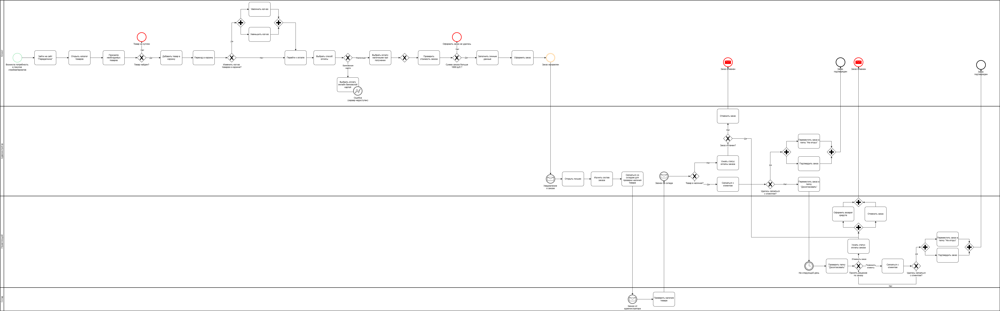
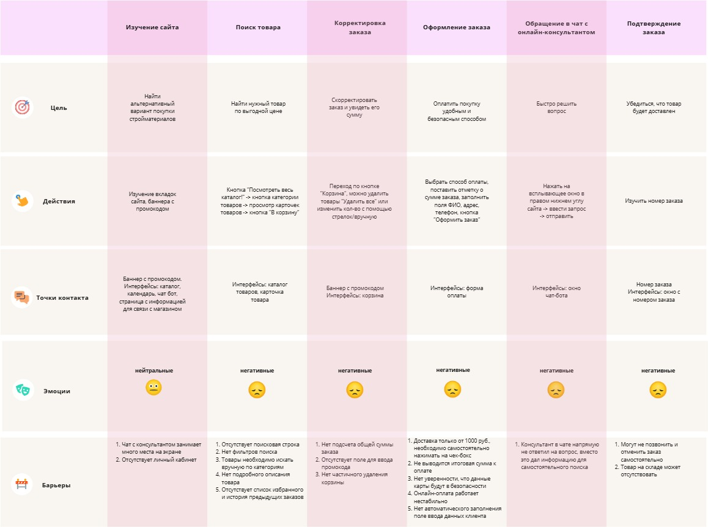

# Отчёт об обследовании для магазина стройматериалов и товаров для дома «Переделкино»
## Введение
### Система, в рамках которой провели обследование
Обследован сайт магазина «Переделкино»: процесс формирования заказов со стороны клиента, обработка заказов сотрудниками магазина.

Задействованы отделы: склад, администратор сайта, управляющий магазина.

Данный документ содержит в себе информацию об исследовании текущих процессов, выявленных проблемах, определяет требования заказчика и ключевую функциональность для оптимизации работы сайта, содержит в себе краткую информацию о внедряемых изменениях.
### Цель обследования
Цель обследования – выявление и анализ текущих недостатков и возможных вариантов решения в работе сайта магазина «Переделкино».
### Методы обследования
1.	Интервью с владельцем;
2.	Анализ документации, составленной по итогам интервью и обследования существующих процессов.
### Источники информации
Во время обследования использовались источники информации:
1.	Расшифровках интервью;
2.	Анализ документации, составленной по итогам обследования системы.

### Глоссарий
В этом отчёте об обследовании применяют такие термины с соответствующими определениями, обозначения и сокращения:
|№ п/п|Термин или сокращение|Определение|
|-|--------|---|
|1|API (Application Programming Interface)|Программный интерфейс приложения, позволяющий интегрировать разные системы и обмениваться данными между ними|
|2|UI-дизайн|Дизайн пользовательского интерфейса|
|3|UX-дизайн|Дизайн взаимодействия с пользователем|
|4|БД|База данных|
|5|Заказчик|ООО «Переделкино»|
|6|Исполнитель|ООО «АйТи Решения Практикум»|

## Основная часть
### Текущее состояние системы AS IS
**Процессы системы AS IS** 

Обследованы следующие отделы и процессы:
| Процесс               | Отдел(ы)               | Степень автоматизации | Используемое ПО и инструменты | Краткое описание шагов                                                                                                                                                                                                 |
|-----------------------|------------------------|------------------------|-------------------------------|-----------------------------------------------------------------------------------------------------------------------------------------------------------------------------------------------------------------------|
| Оформление заказа     | Клиент                | Автоматизирован       | Сайт магазина «Переделкино»   | <ol><li>Поиск товара в каталоге.</li><li>Добавление товара в корзину.</li><li>Увеличение/уменьшение количества товара.</li><li>В разделе «Оформление заказа»:<ul><li>Выбор способа оплаты (наличные, карта).</li><li>Подтверждение суммы заказа (свыше 1000 руб.).</li><li>Заполнение личных данных (ФИО, адрес, телефон).</li></ul></li><li>Система формирует номер заказа и уведомляет об успешном оформлении.</li></ol> |
| Проверка наличия товара | Администратор, склад | Ручной                | Телефон                       | <ol><li>Администратор получает уведомление о заказе.</li><li>Звонит на склад для уточнения наличия товара.</li><li>Склад проверяет наличие товара и сообщает информацию администратору.</li></ol>                                                                                     |
| Подтверждение заказа  | Администратор, управляющий | Ручной                | Телефон                       | <ol><li>Администратор совершает звонок клиенту для подтверждения заказа.<ul><li>Если клиент не ответил на звонок, заказ переносится в папку «Досогласовать».</li><li>Управляющий принимает решение о повторном звонке либо переход к процессу «Отмена заказа».</li></ul></li><li>Информацию по заказу переносят в папку «На отгрузку».</li></ol> |
| Отмена заказа (оплачен) | Управляющий           | Автоматизированный    | Сервис онлайн-оплаты, телефон | <ol><li>Управляющий проверяет наличие оплаты.</li><li>Заходит в ЛК сервиса онлайн-оплаты.</li><li>Оформляет возврат средств и отменяет заказ.</li><li>Клиент уведомляется об отмене заказа.</li></ol>                                                                               |
| Отмена заказа (не оплачен) | Администратор       | Автоматизированный    | Телефон                       | <ol><li>Управляющий проверяет наличие оплаты.</li><li>Администратор уведомляет клиента об отмене заказа.</li></ol>                                                                                                   |

**Модель AS IS нотации BPMN**

Ссылка на модель AS IS-процесса в нотации BPMN: https://drive.google.com/file/d/1gu3U4b7Z1mw21k8qjcxbkXHrVO9xPYx5/view?usp=sharing

**Точки роста**

Для определения точек роста в текущем процессе оформления заказа на сайте, была спроектирована CJM с описанием всего клиентского пути и барьеров на каждом из его этапов.

Ссылка на CJM: https://miro.com/app/board/uXjVLmh2mqI=/?share_link_id=814278988868

В ходе обследования были выявлен ряд проблем и рассмотрены рекомендации для их решения:
| №  | Проблема в существующих процессах                                                                 | Рекомендации для решения                                                                                   |
|----|----------------------------------------------------------------------------------------------------|-----------------------------------------------------------------------------------------------------------|
| 1  | Нестабильно работает онлайн оплата                                                               | Проверить правильность настроек API                                                                       |
| 2  | Отсутствует поисковая строка (ручной поиск товаров по каталогу)                                   | Доработка UX-дизайна сайта                                                                                |
| 3  | Отсутствует подробное описание товара                                                             | Доработка UX-дизайна сайта                                                                                |
| 4  | Отсутствуют фильтры для товаров                                                                   | Доработка UX-дизайна сайта                                                                                |
| 5  | Чат онлайн-поддержки занимает много места                                                         | Доработка UI-дизайна сайта                                                                                |
| 6  | Отсутствует подсчет общей суммы товара                                                            | Доработка UX-дизайна сайта                                                                                |
| 7  | Не выводится итоговая сумма заказа к оплате                                                       | Доработка UX-дизайна сайта                                                                                |
| 8  | Товар может отсутствовать на складе, клиент узнает об этом только после оформления заказа         | Актуализация остатков товаров на сайте с помощью интеграции с БД склада                                   |
| 9  | Отсутствует возможность полного удаления корзины                                                   | Расширение функционала сайта                                                                              |
| 10 | Отсутствует личный кабинет клиента                                                                | Создание личного кабинета (создание БД клиентов)                                                          |
| 11 | Отсутствие избранного и истории предыдущих заказов                                                | Расширение функционала сайта                                                                              |
| 12 | Отсутствует поле для ввода промокода                                                              | Доработка UX-дизайна сайта                                                                                |
| 13 | Отсутствует автоматическое заполнение поля ввода данных клиента                                   | Расширение функционала сайта. Доработка UX-дизайна сайта                                                  |
| 14 | Отсутствует проверка мобильного номера клиента                                                    | Интеграция сайта с помощью API с сервисами для реализации валидации номера через SMS                      |
| 15 | Неэффективная работа чата с онлайн-консультантом                                                  | Создание чат-бота со скриптами                                                                            |
| 16 | Отсутствие уверенности, что данные карты будут в безопасности                                      | Подключение двухфакторной аутентификации через API                                                        |
